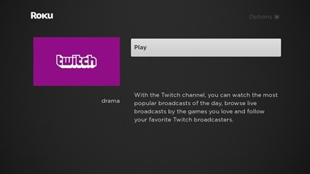

# RCL Guide: DetailsView

## Part 1: Creating the DetailsView

Create the file DetailsViewLogic.brs in the components folder and then add the
line 

```
<script type="text/brightscript" uri="pkg:/components/DetailsViewLogic.brs" /\>
```

to your MainScene.xml.  Now you can start adding functions to your DetailsViewLogic file.  Create the function ShowDetailsView(content, index, isContentList = true).  The arguments will be used for video playback, which we will get to in the next part of this guide.  In this function you need to create the DetailsView, Observe the content, and set the details fields to their respective arguments.  After that, you call show and return the details view object.

```
function ShowDetailsView(content, index, isContentList = true)
     details = CreateObject("roSGNode", "DetailsView")
     details.ObserveField("currentItem", "OnDetailsContentSet")
     details.ObserveField("buttonSelected", "OnButtonSelected")

     details.content = content
     details.jumpToItem = index
     details.isContentList = isContentList

     ' this will trigger job to show this view
     m.top.ComponentController.callFunc("show", {
         view: details
     })

     return details
 end function
```

Now it is time to create the event function we are observing, "OnDetailsContentSet(event as Object)."  The purpose of this function is to update the button information contextually based on the type of content. event.getData() returns the object that was being observed, which in this case is currentItem.  You first must check to see if it is an episode, series, or other (we will launch an episode viewer in a later guide if it is a series, and play the video if it is not).  After that you use event.getRoSGNode() to get the entire object that was being observed (details in this case) and set details.buttons to the buttons we just set.

```
sub OnDetailsContentSet(event as Object)
    details = event.getRoSGNode()
    currentItem = event.getData()
    if currentItem <> invalid
        buttonsToCreate = []

        if currentItem.url <> Invalid and currentItem.url <> ""
            buttonsToCreate.push({title: "Play", id: "play"})
        end if

        if buttonsToCreate.count() = 0
            buttonsToCreate.push({title: "No Content to play", id: "no_content"})
        end if
        m.btnsContent = Utils_ContentList2Node(buttonsToCreate)
    end if
    details.buttons = m.btnsContent
end sub
```

The function included in the previous function "Utils_ContentList2Node ()" is a utility function added to rsg_utils.brs.  It takes in an array of Associative Arrays and creates a node tree that contains the Associative Array data.  

## Part 2: Opening and Closing the DetailsView

Now we need to find out where to call ShowDetailsView() in the first place.  We do this by adding the line 

```
m.grid.ObserveField("rowItemSelected","OnGridItemSelected")
```

to your Mainscene.brs.  Now we create that function.  What we do is get the grid, get the index that was clicked from and the content of the row, then call ShowDetailsView() with the appropriate arguments.  From there we observe "wasClosed" to handle coming back from that details view.

```
sub OnGridItemSelected(event as Object)
     grid = event.GetRoSGNode()

     selectedIndex = event.getdata()
     rowContent = grid.content.getChild(selectedIndex[0])

     detailsView = ShowDetailsView(rowContent, selectedIndex[1])
     detailsView.ObserveField("wasClosed", "OnDetailsWasClosed")
end sub

sub OnDetailsWasClosed(event as Object)
    details = event.GetRoSGNode()

    ‘ adjust the focused grid item in case the user
    ‘ navigated to a different piece of content while in the detail view
    m.grid.jumpToRowItem = [m.grid.rowItemFocused[0], details.itemFocused]
 end sub
```



